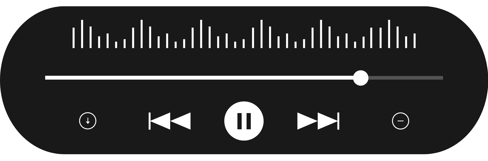

<h3>PODCAST - Vozes Sintéticas</h3>

<a href="./output/podcast_editado.mp3">Escute ao podcast ⬆️</a>

# Projeto Podcast Gerado por I.A.s

 > ℹ️ **NOTE:** Baseado no repositório utilizado no Bootcamp Microsoft 50 Anos - Prompts Inteligentes da [DIO](https://dio.me)

Projeto com o objetivo de gerar um podcast utilizando ferramentas de IA através de prompts mais trabalhado.

Utilizar uma esteira de prompts para gerar cada etapa do processo criativo.

## 💻 Tecnologias utilizadas no projeto

- [ChatGPT](https://chat.openai.com/) 
- [ElevenLabs](https://beta.elevenlabs.io/)
- [Capcut](https://www.capcut.com/pt-br/)

## ✨ Como foi feito ?

- Roteiro e capa gerados via chatgpt
- Audio gerado pela elevenLabs
- Capcut para tratar aúdio e adicionar sons de fundo

## 📚 Materiais

- [Link da live no Youtube](https://www.youtube.com)
- [Notion Template](https://helpful-jump-17b.notion.site/PAS-Podcast-AI-Studio-210489e15d7a4a73b743bb159e45d06f?pvs=4)
- [Editor de aúdio](https://www.capcut.com/editor?from_page=landing_page&__action_from=picture_V%C3%ADdeos%20profissionais%20em%20minutos,%20n%C3%A3o%20em%20horas.)

  

---
